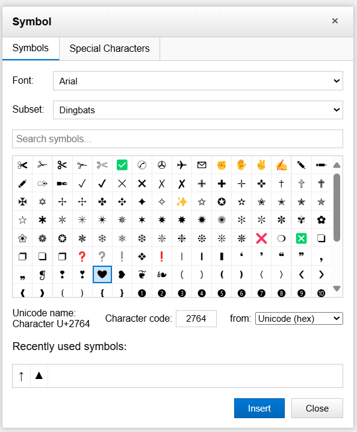

# Unicode Symbol Picker

A lightweight, browser-based Unicode symbol selection tool inspired by Microsoft Excel's symbol dialog. This tool allows users to browse, search, and insert Unicode symbols from various categories.



## 🌟 Features

- **Browse by Category**: Access symbols organized in intuitive categories like Geometric Shapes, Arrows, Mathematical Operators, and more
- **Multiple Font Support**: Switch between different fonts to see how symbols appear in each typeface
- **Search Functionality**: Find specific symbols by name, description, or Unicode value
- **Recent Symbols**: Quick access to recently used symbols
- **Unicode Information**: View detailed Unicode information including character name and code point
- **Multiple Code Formats**: Display character codes in both hexadecimal and decimal formats
- **Keyboard Navigation**: Full keyboard accessibility support for improved usability
- **Copy to Clipboard**: Instantly copy selected symbols to clipboard

## 🚀 Demo

Try the live demo: [Unicode Symbol Picker](https://taher-el-mehdi.github.io/unicode-symbol-picker/)

## 📋 How to Use

1. **Select a Category**: Choose from the "Subset" dropdown to browse different symbol categories
2. **Browse Symbols**: Scroll through the grid to find the symbol you need
3. **Search**: Type in the search box to find specific symbols
4. **Select a Symbol**: Click on any symbol to see its details
5. **Insert/Copy**: Click the "Insert" button to copy the symbol to your clipboard
6. **View Details**: See Unicode information at the bottom of the dialog
7. **Switch Fonts**: Change the selected font to see how symbols render in different typefaces

## 💻 Installation

### Method 1: Clone the Repository
```bash
git clone https://github.com/taher-el-mehdi/unicode-symbol-picker.git
cd unicode-symbol-picker
# Open index.html in your browser
```

### Method 2: Include in Your Project
```html
<!-- Add this to your HTML -->
<iframe src="https://taher-el-mehdi.github.io/unicode-symbol-picker" width="540" height="450"></iframe>
```

## 🛠️ Technical Details

This project is built with:
- **HTML5**: For structure
- **CSS3**: For styling and responsive design
- **Vanilla JavaScript**: For interactive functionality (no dependencies)

The symbol data is organized by Unicode categories, with support for:
- Basic Latin
- Latin-1 Supplement
- Geometric Shapes
- Mathematical Operators
- Box Drawing
- Block Elements
- Arrows
- Dingbats
- Emoji
- Currency Symbols

## 📱 Browser Compatibility
- Chrome 49+
- Firefox 52+
- Safari 10+
- Edge 16+
- Opera 36+

## ⚙️ Customization

### Adding More Symbol Categories

To add more Unicode block ranges, modify the `symbolCategories` object in the JavaScript:

```javascript
const symbolCategories = {
  // Existing categories...
  'Your New Category': {range: [0x2600, 0x26FF]}, // Add your Unicode range
};
```

### Styling

The component uses CSS variables for easy styling. Override these in your project to match your design:

```css
.dialog {
  /* Your custom styles */
  width: 600px;
  background: #fafafa;
}
```

## 🔄 Integration Examples

### With React
```jsx
function App() {
  return (
    <div>
      <h1>Symbol Picker</h1>
      <iframe src="./unicode-symbol-picker.html" width="540" height="450" title="Symbol Picker"></iframe>
    </div>
  );
}
```

### With Vue
```html
<template>
  <div>
    <h1>Symbol Picker</h1>
    <iframe src="./unicode-symbol-picker.html" width="540" height="450"></iframe>
  </div>
</template>
```

## 💡 Potential Enhancements

- [ ] Custom category creator
- [ ] Symbol favorites
- [ ] Export symbol collections

## 🤝 Contributing

Contributions are welcome! Please feel free to submit a Pull Request.

1. Fork the repository
2. Create your feature branch (`git checkout -b feature/amazing-feature`)
3. Commit your changes (`git commit -m 'Add some amazing feature'`)
4. Push to the branch (`git push origin feature/amazing-feature`)
5. Open a Pull Request

## 📄 License

This project is licensed under the MIT License - see the [LICENSE](LICENSE) file for details.

## 🙏 Acknowledgments

- Inspired by Microsoft Excel's symbol dialog
- Unicode data based on the [Unicode Standard](https://unicode.org/)
- Icons and UI inspiration from Microsoft Office design language

---

Made with ❤️ by TAHER El Mehdi

If you find this project useful, please consider giving it a star ⭐ on GitHub!
